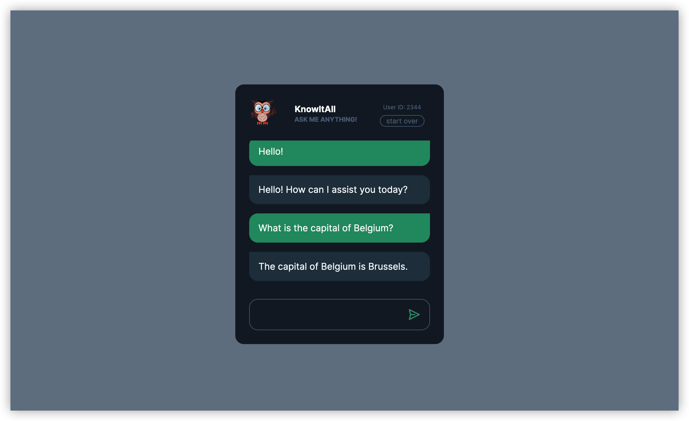

# KnowItAll Chatbot

## Overview

KnowItAll ChatBot, a web application, combines Firebase Realtime Database with the OpenAI `GPT-3.5 Turbo` model to deliver an interactive chatbot experience. This integration enables the chatbot to understand user inputs and offer responses that mimic human conversation, resulting in a lively and captivating interaction. 

## Quick Start

steps:

1. `git clone https://github.com/yao-le/knowItAll.git`
2. `npm install`
3. configure your OpenAI API key in env.js, and Firebase database URL in index.js
4. `npm start`